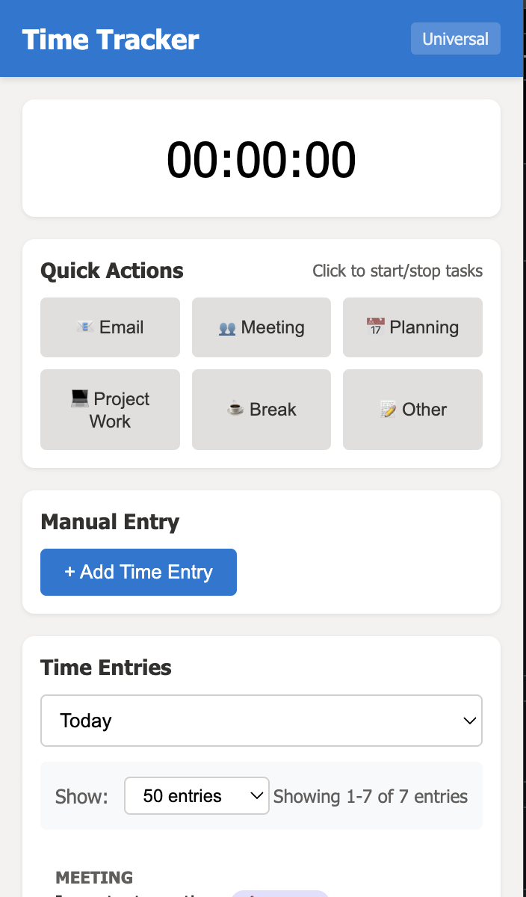
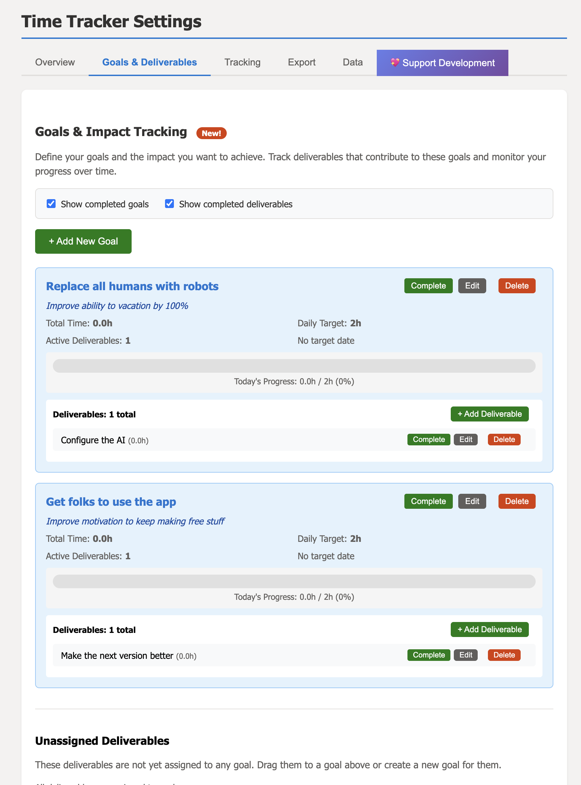
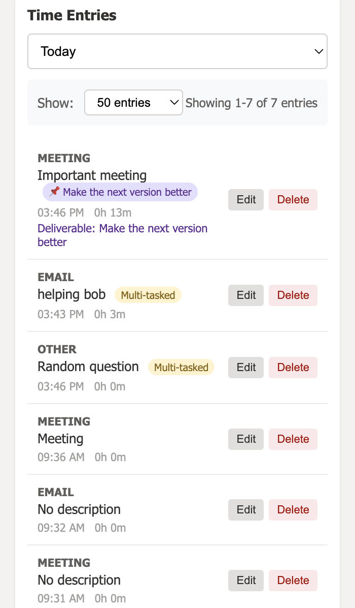
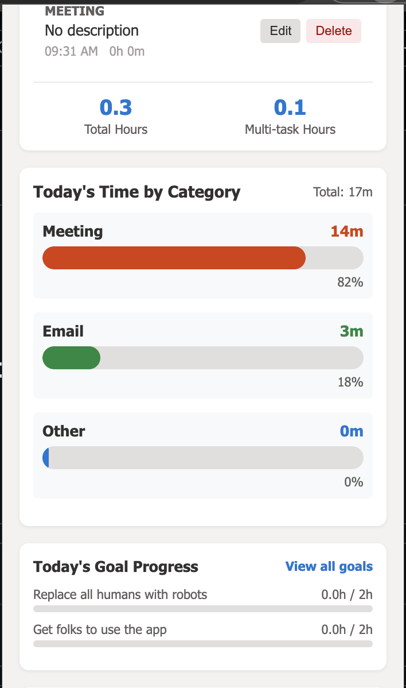
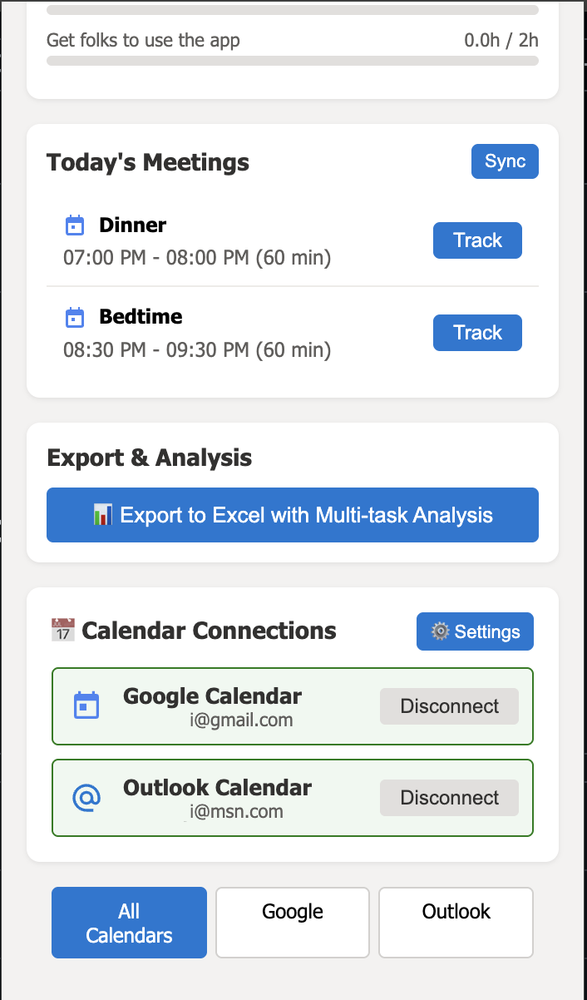

# 📊 Universal Time Tracker - Chrome Extension

### *The only time tracker that admits you multitask during meetings*

[](https://github.com/Maniwar/time_tracker)
[](LICENSE)
[](https://chrome.google.com/webstore)
[](https://github.com/sponsors/Maniwar)

## 🎯 Why This Exists

Time doesn't just slip through our fingers—it gets absorbed by meetings, "quick questions," and context switching that never shows up in reports. Without data, these invisible hours become invisible problems.

**Universal Time Tracker** gives you the ammunition to prove what you already know: your team needs more people.

## 🎥 Demo Video

<p align="center">
  <a href="https://www.youtube.com/watch?v=npvJVmmRK5o">
    
  </a>
  <br/>
  <sub>Click to watch on YouTube</sub>
</p>

## 📸 Screenshots

<table>
  <tr>
    <td align="center">
      <a href="screenshots/screen_timetrackerpop.png">
        
      </a><br>
      <sub><b>Tracker Popup</b></sub>
    </td>
    <td align="center">
      <a href="screenshots/screen_addgoals.png">
        
      </a><br>
      <sub><b>Add Goals</b></sub>
    </td>
    <td align="center">
      <a href="screenshots/screen_timeentries.png">
        
      </a><br>
      <sub><b>Time Entries</b></sub>
    </td>
  </tr>
</table>

<details>
  <summary align="right">▶ More screenshots</summary>

  <br>

  <table>
    <tr>
      <td align="center">
        <a href="screenshots/screen_timebycategorysummary.png">
          
        </a><br>
        <sub><b>Category Summary</b></sub>
      </td>
      <td align="center">
        <a href="screenshots/screen_calendar_export.png">
          
        </a><br>
        <sub><b>Calendar Export</b></sub>
      </td>
      <td align="center">
        <em>&nbsp;</em>
      </td>
    </tr>
  </table>

</details>


## ✨ Features

### 🔥 Core Features
- **Multi-tasking Tracking** - Finally, honest data about doing email during meetings
- **Auto-Tracking** - Meetings start/stop automatically based on your calendar
- **Universal Calendar Support** - Works with both Google Calendar and Outlook
- **Quick Actions** - One-click tracking for your most common tasks
- **Manual Entry** - Forgot to track? Add time after the fact
- **Goals & Deliverables** - Connect time to actual outcomes

### 📈 Analytics & Reporting
- **Excel Export** - Comprehensive reports with multiple analysis sheets
- **Multi-tasking Analysis** - See your real productivity patterns
- **Meeting Efficiency** - Discover what % of meetings involve multitasking
- **Productivity Scoring** - Understand focus time vs. fragmented time
- **Time Saved Tracking** - Know when meetings end early
- **Category Breakdowns** - Visual charts of where time really goes

### 🎯 Unique Features
- **Dual Timer Display** - See both meeting and task time simultaneously
- **End Early Button** - Capture actual vs. scheduled meeting time
- **Deliverable Tracking** - Link time to specific outcomes
- **Goal Progress** - Daily targets with visual progress bars
- **Auto-sync** - Pull meetings from multiple calendars
- **Privacy First** - All data stays local in your browser

## 🚀 Installation

### Quick Install (For Your Team)

1. **Download** the extension folder from [here](https://github.com/Maniwar/time_tracker/archive/refs/heads/main.zip)
2. Open Chrome and go to `chrome://extensions/`
3. Enable **Developer mode** (top right)
4. Click **Load unpacked**
5. Select the extension folder
6. Pin the extension to your toolbar

### Build From Source

```bash
git clone https://github.com/Maniwar/time_tracker.git
cd time_tracker
# No build needed - it's vanilla JS!
```

## 🔧 Setup

### 1. Connect Your Calendar (Optional but Recommended)

#### Google Calendar (Easy - One Click)
1. Click extension icon
2. Click **Connect** next to Google Calendar
3. Sign in and approve permissions
4. Done! Meetings auto-populate

#### Outlook Calendar (Requires Azure Setup)
1. [Register an app in Azure](https://portal.azure.com/#blade/Microsoft_AAD_RegisteredApps/ApplicationsListBlade)
2. Add redirect URI: `https://[extension-id].chromiumapp.org/`
3. Copy Application (client) ID
4. Right-click extension → Options → Paste Client ID
5. Return to popup → Connect Outlook

### 2. Configure Settings
- **Quick Actions**: Choose your 6 most-used task types
- **Categories**: Add custom categories for your workflow
- **Auto-Tracking**: Enable to never miss a meeting
- **Goals**: Set daily targets and track progress

## 💡 How to Use

### Basic Time Tracking

#### Quick Start (Recommended)
```
1. Click extension icon
2. Click a Quick Action button (e.g., "📧 Email")
3. Add optional description
4. Timer starts
5. Click again to stop
```

#### Meeting with Multi-tasking
```
1. Start a meeting (turns orange)
2. Start another task while meeting runs
3. Both timers run: "👥 00:15:00 | 💻 00:05:00"
4. Stop tasks independently
```

#### Auto-Tracking Meetings
```
1. Enable in Settings → Auto-Tracking
2. Set grace period (default: 2 min before start)
3. Meetings start/stop automatically
4. Click "End Early" if meeting finishes sooner
```

### Manual Entry (Forgot to Track?)

1. Click **"+ Add Time Entry"**
2. Select category and duration
3. Choose when it happened:
   - Just finished
   - X minutes/hours ago
   - Specific time
4. Check "I was multi-tasking" if applicable
5. Save

### Viewing Your Data

- **Today/Week/Month** - Filter by date range
- **Category Totals** - See time distribution
- **Goals Progress** - Track against daily targets
- **Export to Excel** - Get detailed analysis

## 📊 Understanding Your Reports

### Excel Export Includes:

1. **Time Entries** - Raw data with all details
2. **Deliverable Analysis** - Progress on specific outcomes
3. **Goal Analysis** - Achievement against targets
4. **Multi-tasking Analysis** - Daily breakdown of parallel work
5. **Productivity Summary** - Scores and insights

### Key Metrics Explained:

- **Multi-tasking %**: Percentage of time doing multiple things
- **Meeting Efficiency**: How much of meeting time involves other work
- **Productivity Score**: 100 = fully focused, <100 = multi-tasked
- **Time Saved**: Minutes saved by ending meetings early

## 🎯 Use Cases

### For Individual Contributors
- Prove you're in too many meetings
- Show time lost to context switching
- Track progress on deliverables
- Identify your peak productivity hours

### For Managers
- **Justify headcount** with real data
- Identify meeting overload patterns
- Track team capacity accurately
- Show impact of interruptions

### For Teams
- Discover which meetings everyone multitasks through
- Find optimal no-meeting blocks
- Balance workload distribution
- Track project time accurately

## 🔒 Privacy & Security

- ✅ **All data stored locally** - Never leaves your browser
- ✅ **Read-only calendar access** - Can't modify your events
- ✅ **No telemetry** - We don't track you tracking time
- ✅ **Open source** - Audit the code yourself
- ✅ **No account required** - Start immediately
- ✅ **Export anytime** - Your data is yours

## 💰 Pricing

**Free. Forever. No BS.**

- No premium tiers
- No locked features
- No user limits
- No trial period
- Just free

If it helps you get headcount or saves your sanity, consider [sponsoring](https://github.com/sponsors/Maniwar). Or don't. Really.

## 🤝 Contributing

We love contributions! 

- 🐛 [Report bugs](https://github.com/Maniwar/time_tracker/issues)
- 💡 [Request features](https://github.com/Maniwar/time_tracker/issues)
- 🔧 [Submit PRs](https://github.com/Maniwar/time_tracker/pulls)
- ⭐ [Star the repo](https://github.com/Maniwar/time_tracker)
- 💬 [Share success stories](https://github.com/Maniwar/time_tracker/discussions)

### Development Setup

```bash
# Clone the repo
git clone https://github.com/Maniwar/time_tracker.git

# Load in Chrome
1. Navigate to chrome://extensions/
2. Enable Developer Mode
3. Click "Load unpacked"
4. Select the cloned folder

# Make changes and reload extension
```

### Project Structure

```
time_tracker/
├── manifest.json        # Extension configuration
├── popup.html          # Main UI
├── popup.js            # Core logic
├── background.js       # Service worker for Outlook
├── google-calendar.js  # Google Calendar integration
├── options.html        # Settings page
├── options.js          # Settings logic
├── xlsx.min.js         # Excel export library
└── icons/              # Extension icons
```

## 📈 Aspirational Success Stories

> "Used Universal Time Tracker to show we spend 70% of time in meetings. We now have no-meeting Wednesdays."  
> — *Engineering Manager, 50-person startup*

> "Finally got the two headcount we needed. Your multi-tasking reports made the difference."  
> — *Tech Lead, Fortune 500*

> "Proved that 'quick questions' take 15 hours/week. Now we have office hours instead."  
> — *Senior Developer*

**Got a success story?** [Share it here!](https://github.com/Maniwar/time_tracker/discussions)

## 🛠️ Troubleshooting

### Extension Not Working?
1. Go to `chrome://extensions/`
2. Find Universal Time Tracker
3. Click refresh icon
4. Check browser console (F12) for errors

### Calendar Not Syncing?
- **Google**: Re-connect through popup
- **Outlook**: Verify Client ID in settings
- Check you're logged into your calendar account

### Data Questions?
- All data in: `chrome.storage.local`
- Export regularly for backup
- Use Settings → Data → Create Backup

## 🚀 Roadmap

- [ ] Jira/Linear integration
- [ ] Slack notifications
- [ ] Team dashboards
- [ ] AI-powered insights
- [ ] Mobile companion app
- [ ] Pomodoro timer mode
- [ ] Browser tab time tracking

## 📜 License

MIT License - Use it, modify it, share it. Just make work better.

## 🙏 Acknowledgments

Built by [@Maniwar](https://github.com/Maniwar) because time tracking shouldn't feel like surveillance.

Special thanks to everyone who's used this to get their team the help they need.

## 💖 Support Development

This tool is free and always will be. If it helped you:

[](https://github.com/sponsors/Maniwar)
[](https://github.com/Maniwar/time_tracker)

Or just [share your success story](https://www.linkedin.com/sharing/share-offsite/?url=https://github.com/Maniwar/time_tracker) - that's payment enough.

---

**Remember:** Every untracked hour is an invisible argument against your headcount request. Every tracked hour is evidence that your team needs help.

*Start tracking. Get the data. Build your case. Get your team the reinforcements they deserve.*

---

<p align="center">
  <strong>Questions?</strong> Open an issue<br>
  <strong>Love it?</strong> Star it<br>
  <strong>Improved your work life?</strong> <a href="https://github.com/sponsors/Maniwar">Buy me coffee</a><br>
  <br>
  <em>"In God we trust. All others must bring data."</em><br>
  — W. Edwards Deming
</p>
